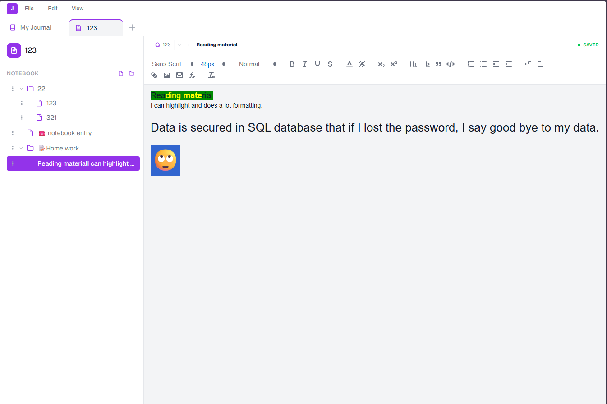

# TheJournal

A cross-platform journaling and note-taking application built with Next.js and Electron. Features both journal-style date-based entries and notebook-style hierarchical pages.

## Screenshots


*Privacy-first authentication with local-only storage.*


*Organize your thoughts with hierarchical pages and sections.*

## Features

- 📅 **Journal Mode** - Date-based entries with calendar navigation
- 📓 **Notebook Mode** - Hierarchical pages and sections with drag-and-drop
- 🔒 **End-to-End Local Encryption** - Full database encryption via SQLCipher (AES-256)
- 🔑 **Secure Key Derivation** - Argon2id master key derivation for maximum security
- 🎨 **Rich Text Editor** - Full formatting with TipTap
- 🌙 **Dark/Light Themes** - System-aware with manual toggle
- 💾 **Auto-Save** - Content saved automatically with crash recovery
- 📦 **Import/Export** - Encrypted backups of your entire journal
- 🔍 **Search** - Full-text search across titles and content with advanced filters
- 🪟 **Split View** - Side-by-side editor panes for multi-entry editing

## Getting Started

### Development (Web)

```bash
npm install
npm run dev
```

Open [http://localhost:3000](http://localhost:3000) in your browser.

### Development (Electron)

```bash
npm run dev:electron
```

### Production Build

```bash
# Build Next.js
npm run build:electron

# Build installer
npm run build:installer
```

## Search

Press **Ctrl+F** anywhere in the journal view to open the search panel, or use the **View → Search** menu item, or right-click in the editor.

### Simple search
Type any text and results appear as you type (350 ms debounce). Click a result to navigate directly to that entry.

### Advanced search
Click **Advanced** in the search panel to reveal additional filters:

| Filter | Options |
|--------|---------|
| Search in | Titles only · Content only · Both |
| Scope | Current notebook/journal · All |
| Date range | From / To date pickers |
| Entry type | All · Journal · Notebook |
| Match case | Exact case matching |
| Whole word | Word-boundary matching |

Results show a snippet centred on the first match with the matching text highlighted. Pagination loads 30 results at a time.

## Testing

The project uses [Vitest](https://vitest.dev/) for stress and integration tests that exercise the database layer directly (no HTTP).

### Run all tests

```bash
npm test
```

### Watch mode (re-runs on file save)

```bash
npm run test:watch
```

### Test structure

```
tests/
└── stress/
    └── db.stress.test.ts   # 20 tests across 10 suites
```

Each test run creates an isolated temporary database, seeds it with a test user, and deletes all three SQLite files (`.tjdb`, `.tjdb-shm`, `.tjdb-wal`) on teardown.

### What the stress tests cover

| Suite | Tests | Scenario |
|-------|-------|----------|
| Concurrent by-date creation | 2 | 20 simultaneous requests for the same date → exactly 1 entry created (dedup) |
| Optimistic locking | 2 | 10 concurrent writes to version 1 → 1 succeeds, 9 get 409 conflict |
| Sequential saves | 1 | 50 sequential saves increment the version counter correctly |
| Recursive delete — deep | 1 | 100-level chain deleted atomically in < 2 s, no orphaned rows |
| Recursive delete — wide | 1 | Root with 500 direct children deleted in < 3 s, content cleaned up |
| Move guards | 4 | Self-parent rejected, cycle (A→B→C→A) rejected, valid moves pass |
| ViewSettings concurrency | 1 | 20 concurrent JSON merges → all 20 keys present in final result |
| AsyncMutex exclusion | 1 | 30 concurrent counter increments → no lost updates |
| Large dataset | 1 | 1 000 entries inserted, correct subset retrieved |
| Cascade delete integrity | 2 | Deleting entry removes `EntryContent`; partial chain delete leaves no orphans |
| Rapid create/delete | 1 | 200 create+delete ops in rapid succession, DB left clean |
| Edge cases | 3 | Non-existent delete, same date across two categories, version conflict skips content |

### Prerequisites for tests

The database layer uses `@journeyapps/sqlcipher`, a native module linked against **OpenSSL 1.1**. On Ubuntu 22.04+ (which ships OpenSSL 3) you need to install the compatibility library first:

```bash
# Download and install libssl1.1 (one-time, system-wide)
wget http://security.ubuntu.com/ubuntu/pool/main/o/openssl/libssl1.1_1.1.1f-1ubuntu2.24_amd64.deb
sudo dpkg -i libssl1.1_1.1.1f-1ubuntu2.24_amd64.deb

# Re-download the pre-built binary so it links against the installed library
cd node_modules/@journeyapps/sqlcipher
npx node-pre-gyp install --update-binary
cd ../../..

# Verify
node -e "require('@journeyapps/sqlcipher')" && echo "OK"
```

## Project Structure

```
src/
├── app/                    # Next.js App Router
│   ├── api/                # REST API endpoints
│   │   ├── backup/         # Import/Export DB
│   │   ├── category/       # Notebook/Journal CRUD
│   │   ├── entry/          # Entry CRUD, by-date, dates
│   │   ├── search/         # Full-text search endpoint
│   │   └── health/         # Health check
│   ├── dashboard/          # Dashboard page
│   ├── journal/[categoryId]/ # Journal/Notebook view
│   ├── login/              # Authentication
│   ├── globals.css         # Theme variables & styles
│   ├── layout.tsx          # Root layout with providers
│   └── providers.tsx       # Theme & Electron IPC setup
│
├── components/
│   ├── journal/
│   │   ├── Editor.tsx      # Rich text editor with auto-save, Ctrl+F shortcut
│   │   ├── SplitEditor.tsx # Side-by-side dual-pane editor
│   │   ├── JournalView.tsx # Top-level view, owns search state
│   │   ├── SearchPanel.tsx # Full-text search overlay (simple + advanced)
│   │   ├── EntryGrid.tsx   # Grid view for entries
│   │   ├── Sidebar.tsx     # Navigation (calendar/tree)
│   │   └── TabBar.tsx      # Tab management & menus
│   ├── dashboard/
│   │   └── CategoryCard.tsx
│   └── ThemeToggle.tsx     # Theme switch button
│
├── hooks/                  # Reusable React hooks
│   ├── useClickOutside.ts  # Detect clicks outside element
│   ├── useElectronIPC.ts   # Safe IPC event subscription
│   └── index.ts            # Barrel export
│
├── lib/
│   ├── db.ts               # Encrypted SQLite connection (SQLCipher)
│   ├── auth.ts             # Argon2id key derivation & hashing
│   └── types.ts            # TypeScript interfaces
│
└── electron/               # Electron main process
    ├── main.js             # Window creation & menu
    ├── preload.js          # Context bridge API
    └── settings.js         # User settings persistence

tests/
└── stress/
    └── db.stress.test.ts   # Database stress and integration tests
```

## Component Responsibilities

| Component | Description |
|-----------|-------------|
| **TabBar** | Category tabs, drag-to-reorder, File/View menus |
| **Sidebar** | Journal calendar or notebook tree navigation |
| **JournalView** | Orchestrates editor, split view, and search overlay |
| **Editor** | TipTap-based rich text with auto-save, recovery, and Ctrl+F |
| **SplitEditor** | Dual-pane editor with independent entry loading and optimistic save |
| **SearchPanel** | Full-text search overlay with live results and advanced filters |
| **EntryGrid** | Grid display for browsing past entries |

## API Endpoints

| Method | Path | Description |
|--------|------|-------------|
| GET | `/api/search` | Full-text search across titles and content |
| GET/POST | `/api/entry` | List / create entries |
| GET/PUT/DELETE | `/api/entry/[id]` | Read / update / delete a single entry |
| POST | `/api/entry/move` | Move entry to a new parent (cycle-safe) |
| GET | `/api/entry/by-date` | Fetch or create today's journal entry |
| GET/PUT/DELETE | `/api/category/[id]` | Category management |
| GET/POST | `/api/backup` | Export / import encrypted backup |

### Search API

```
GET /api/search?q=hello+world
```

| Parameter | Default | Description |
|-----------|---------|-------------|
| `q` | — | Search terms (required) |
| `categoryId` | — | Restrict to one notebook/journal |
| `dateFrom` | — | ISO date lower bound |
| `dateTo` | — | ISO date upper bound |
| `searchIn` | `both` | `title` · `content` · `both` |
| `entryType` | `all` | `all` · `journal` · `notebook` |
| `matchCase` | `false` | Case-sensitive matching |
| `wholeWord` | `false` | Whole-word matching |
| `limit` | `30` | Results per page |
| `offset` | `0` | Pagination offset |

Response:
```json
{
  "results": [
    {
      "EntryID": 42,
      "Title": "My Entry",
      "snippet": "…matched context…",
      "CategoryID": 1,
      "CategoryName": "My Journal",
      "EntryDate": "2024-01-15"
    }
  ],
  "total": 120,
  "hasMore": true
}
```

## Database Schema

- **User** - Authentication
- **Category** - Journals and Notebooks
- **Entry** - Individual pages/journal entries (with `Version` field for optimistic locking)
- **EntryContent** - HTML body of each entry (cascade-deleted with Entry)

## Tech Stack

- **Frontend**: Next.js 16, React 19, TypeScript
- **Editor**: @tiptap/react (+ TipTap extensions)
- **Styling**: Tailwind CSS with CSS variables
- **Database**: @journeyapps/sqlcipher (AES-256 Encrypted)
- **Key Derivation**: Argon2id
- **Desktop**: Electron 35
- **DnD**: @dnd-kit
- **Testing**: Vitest 4
